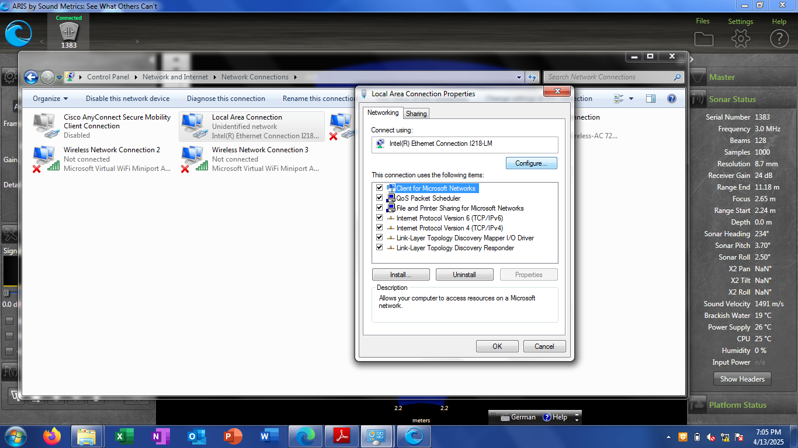
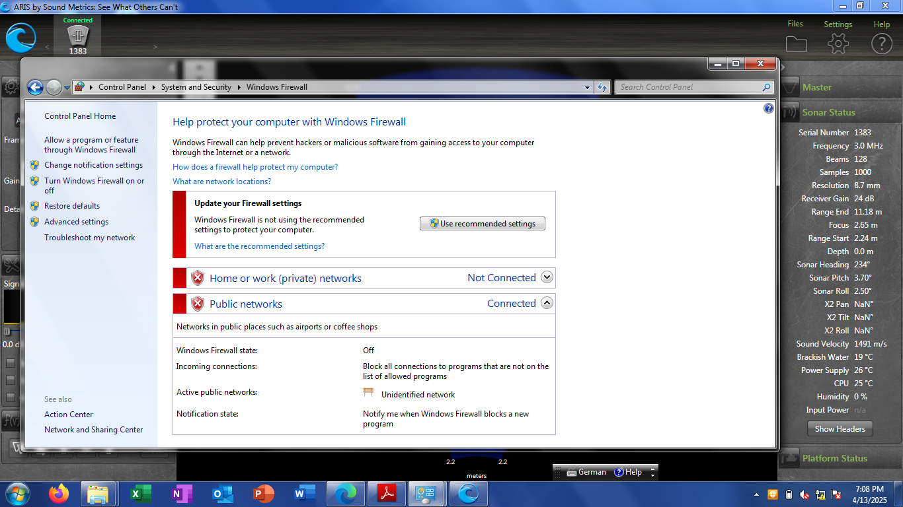
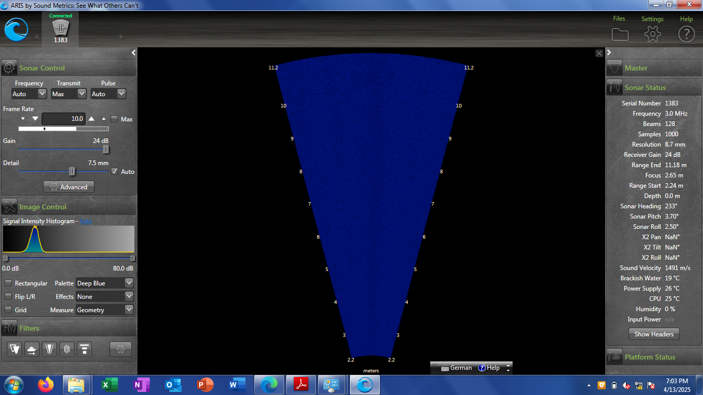

# ARIS Explorer 3000:

Full manual for ARIS Explorere sonars, [here](https://www.manualslib.com/manual/2984232/Sound-Metrics-Aris-Explorer.html?page=1#manual)

## Simple connection (Windows+ARISCOPE)

1. Set-up the sonar and the cable connections as indicated in the [Setting Up the Explorer](https://www.manualslib.com/manual/2984232/Sound-Metrics-Aris-Explorer.html?page=12#manual) section in the manual.

2. If the sonar is not detected by the ARISCOPE software, please adjust the network settings as follows (see images below for reference):
    1. Go to `Control Panel > Network and Internet > Network Connections` and open the `Properties` of your LAN connection.
    2. Go into the `Configure` option and in the `Advanced` tab, set `Energy Efficient Ethernet` as `Off`.
    3. Go into the `Power Management` tab and disable the option `Allow the computer to turn off this device to save power`.
    4. In the section `Control Panel > System and Security > Windows Firewall` disable the firewall. (Note: Be aware of this when you resume normal work on your PC).

    
    
    
    
     

The ARISCOPE GUI looks similar to this:

## ROS 1 Data

Data or bagfiles acquired under ROS 1 have the following messages and topics.

| ROS1 Topic     | ROS 1 Msg Type   | Comment    |
|:---------------|:--------------|:---------------|
| /soundmetrics_aris3000/cartesian | sensor_msgs/Image  | See ROS docs for more info  |
| /soundmetrics_aris3000/polar  | sensor_msgs/Image  | See ROS docs for more info  |
| /soundmetrics_aris3000/sonar_info  | cola2_msgs/SonarInfo  | Propietary msg from MOPRH project, need to investigate  |

